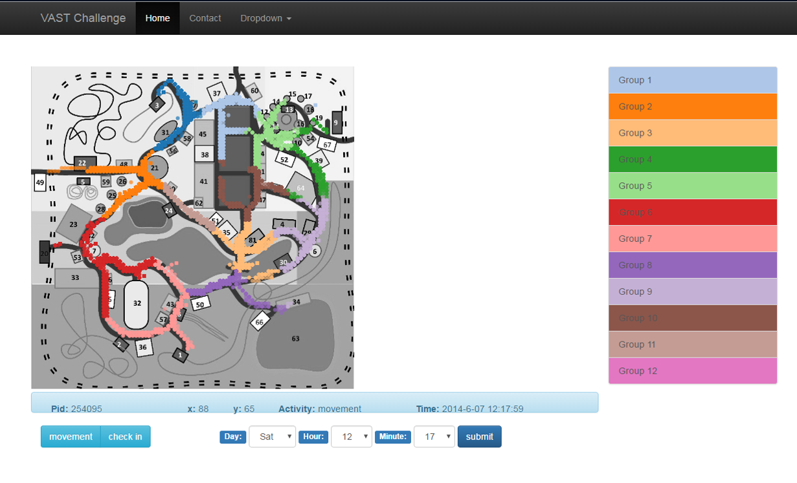

# VAST Challenge 2015

### About the VAST Challenge
The Visual Analytics Science and Technology ([VAST2015]) Challenge is an annual contest with the goal of advancing the field of visual analytics through competition. The VAST Challenge is designed to help researchers understand how their software would be used in a novel analytic task and determine if their data transformations, visualizations, and interactions would be beneficial for particular analytic tasks. VAST Challenge problems provide researchers with realistic tasks and data sets for evaluating their software, as well as an opportunity to advance the field by solving more complex problems.

Researchers and software providers have repeatedly used the data sets from throughout the life of the VAST Challenge as benchmarks to demonstrate and test the capabilities of their systems. The ground truth embedded in the data sets has helped researchers evaluate and strengthen the utility of their visualizations.

### Project Introduction
VAST2015 is a visualization system to represent the data of [VAST2015 Challenge 1]. The system was implemented by d3.js, and deployed by node-express. 
The data was saved in json file, which has been clustered using k-means(A clustering algorithm).

### Usage 
The main view of the system is as follows:

The time are limited by data, the following time submits are avaliable:
- **Day**:Fri **Hour**:20 **Minute**:12
- **Day**:Fri **Hour**:20 **Minute**:15
- **Day**:Fri **Hour**:20 **Minute**:17
- **Day**:Fri **Hour**:22 **Minute**:17
- **Day**:Sat **Hour**:12 **Minute**:17

### Dependencies
- nodeJS:  v4.4.3
- express:  v4.13.1
- d3.js
- bootstrap

### Contact
sherine Du (dosherine@zju.edu.cn)

### Licence
MIT

   [VAST2015]: <http://vacommunity.org/VAST+Challenge+2015>
   [VAST2015 Challenge 1]:<http://vacommunity.org/2015+VAST+Challenge%3A+MC1>
